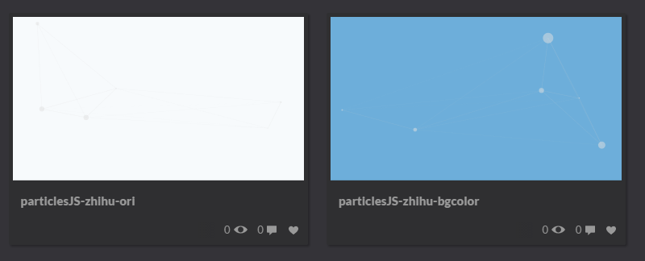
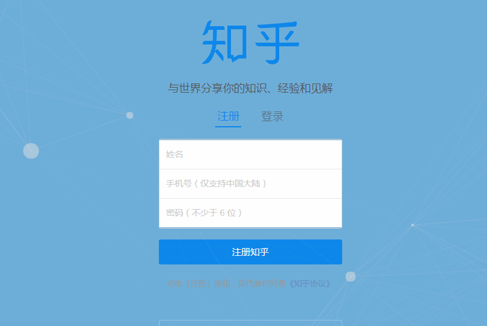
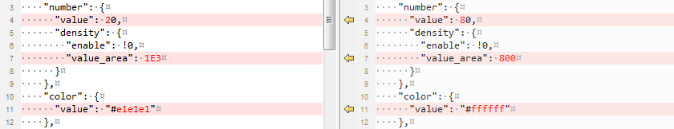
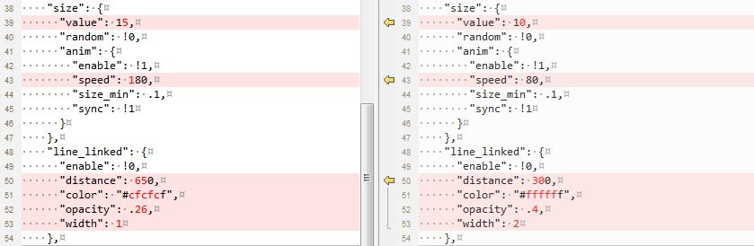
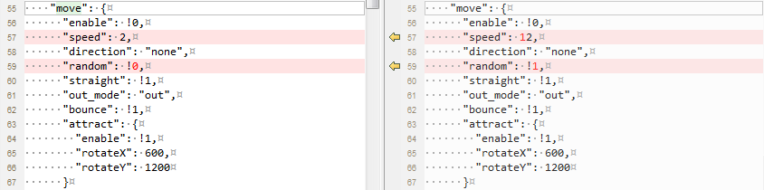
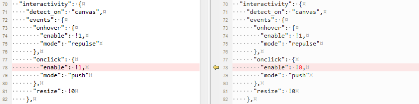

# 知乎登录/注册页之动态背景
知乎登录页的动态背景是使用[particles.js](https://github.com/VincentGarreau/particles.js/)库实现的。
我把该部分的代码单独抽离出来，在[codepen](http://codepen.io/nfer/pen/egRKvW)上进行了完全复现。

## 背景色
知乎使用的背景颜色太浅了，我相信不止我一个人会认为**是不是我的屏幕脏了？**

我将css代码中的`background: #f7fafc;`替换成`background: #6daeda;`后，效果就很明显了：


## particles元素
因为知乎是把particles.js作为背景展示的，所以设置了如下的css属性：
```
#particles {
    position: absolute;
    top: 0;
    z-index: -1;
    width: 100%;
    height: 100%
}
```
这里用了绝对定位，并且把particles元素放到最底层。不过，我更倾向于把particles元素放到最顶层，但是不响应任何事件。看上去更好玩一些~
```
#particles {
    position: absolute;
    top: 0;
    z-index: 999;
    pointer-events: none;
    width: 100%;
    height: 100%;
}
```


## canvas画布
particles元素下包含了一个canvas画布，在css中设定了display属性：
```
#particles canvas {
    display: block
}
```
并且使用了行内css的方式设置了width和height均为100%:
```
<canvas class="particles-js-canvas-el" style="width: 100%;height: 100%;" width="1423" height="810"></canvas>
```
在我的Chrome(54)和Firefox(50)环境下，canvas元素的默认display属性值都是`inline`，那么问题来了，**为什么这里要设置canvas的显示为`block`?**

通过测试我们发现，去掉`display: block`后就会出现垂直滚动条，加上该css后就不会显示垂直滚动条。

在[stackoverflow](http://stackoverflow.com/questions/19882987/html-css-remove-vertical-scroll-with-height-100)中有如下解释：
>It's because of the 1px borders on each side of the element.
100% + 2px border(s) != 100%.

如何解决高度100%的情况下仍然显示滚动条的问题呢？有以下几种方法：
 - 使用`calc()`减去2px：
```
height: calc(100% - 2px);
```
 - 设置元素的display属性值为`block`
```
    display: block
```
很明显第一种写法不如第二种写法更简约。

更多参考资料：
 - [html5-canvas-100-width-height-of-viewport](http://stackoverflow.com/questions/4288253/html5-canvas-100-width-height-of-viewport)
 - [html-css-remove-vertical-scroll-with-height-100](http://stackoverflow.com/questions/19882987/html-css-remove-vertical-scroll-with-height-100)
 - [Canvas should be display block to remove scrollbars](https://github.com/necolas/normalize.css/issues/362)

## particlesJS参数
particlesJS完整参数见[codepen](http://codepen.io/nfer/pen/egRKvW)，我把知乎登录页使用的参数和官方示例做了对比，主要改动部分如下：
 1. 修改粒子的 数量/颜色/大小，连接线的 距离/颜色/透明度/宽度
 
 
 2. 修改粒子移动的 速度/随机性
 
 3. 设置 不开启onhover和onclick事件
 

interactivity参数中还有一些不同，但是既然已经关闭了onhover和onclick事件，其他的参数设置与否都不起作用了。

## 总结
particles.js库可以做出各种酷炫的效果，在知乎登录页面中，内容的优先级要比背景的优先级要高很多，如果背景太显眼了反而会喧宾夺主。

更多酷炫particle.js示例，请点击下述codepen链接：
 - [Official demo](http://codepen.io/VincentGarreau/pen/pnlso)
 - [lightbulb + particles + blending mode](http://codepen.io/mephysto/pen/amgQgp)
 - [Moar Plasma](http://codepen.io/johnchinjew/full/dMqwWw/)
 - [particles snow](http://codepen.io/nsayenko/full/qOXKVr/)