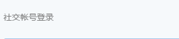
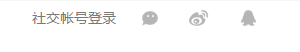
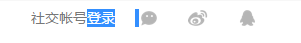

# 知乎登录/注册页之标签切换动画
在知乎登录/注册页面，点击“社交账号登录”可以弹出微信、微博、QQ登录的图标，动图如下：



我把该部分的代码单独抽离出来，在[codepen](http://codepen.io/nfer/pen/oBdoVe)上进行了完全复现。

本文就是分析一下这个效果的实现。

## 基本页面元素
html部分：
```html
<div class="index-main">
  <div class="index-main-body">
    <div class="social-signup-wrapper">
      <span class="name js-toggle-sns-buttons">社交帐号登录</span>
      <div class="sns-buttons">
        <a title="微信登录" class="js-bindwechat" href="#">
          <i class="sprite-index-icon-wechat"></i>
        </a>
        <a title="微博登录" class="js-bindweibo" href="#">
          <i class="sprite-index-icon-weibo"></i>
        </a>
        <a title="QQ 登录" class="js-bindqq" href="#">
          <i class="sprite-index-icon-qq"></i>
        </a>
      </div>
    </div>
  </div>
</div>
```
CSS部分
```
.index-main {
  text-align: center;
}

.index-main-body {
  display: inline-block;
  width: 300px;
}

.social-signup-wrapper {
  text-align: left;
  font-size: 14px;
  font-family: 'Helvetica Neue', Helvetica, 'PingFang SC', 'Hiragino Sans GB', 'Microsoft YaHei', Arial, sans-serif;
}

.social-signup-wrapper .name {
  vertical-align: middle;
  margin-right: 20px;
  color: #787878;
}

.social-signup-wrapper .sns-buttons {
  display: inline-block;
}

.social-signup-wrapper .sns-buttons a {
  color: inherit;
  text-decoration: none;
  margin: 0 25px 0 0;
  opacity: .7;
  -ms-filter: "alpha(Opacity=70)";
}

.sprite-index-icon-wechat {
  background-position: -56px -20px;
  width: 20px;
  height: 18px;
}

.sprite-index-icon-weibo {
  background-position: 0 -44px;
  width: 20px;
  height: 18px;
}

.sprite-index-icon-qq {
  background-position: -56px 0;
  width: 20px;
  height: 18px;
}

.sprite-index,
[class*=sprite-index-] {
  background-image: url(http://nferzhuang.com/wp-content/uploads/2017/02/sprites.auto_.fe745534.png);
  background-repeat: no-repeat;
}

[class*=sprite-index-icon-] {
  display: inline-block;
  vertical-align: middle;
}
```
注意，在上述的css代码中：
 - 居中对齐仍然是使用两层div结合`text-align: center`和`display: inline-block`实现
 - 文字和小图标之间的间距是20px，小图标之间的间距是25px
 - 文字和小图标都是使用`vertical-align: middle`进行垂直居中显示
 - 小图标使用雪碧图显示
 - a标签不显示下划线



## 隐藏/显示小图标
知乎登录/注册页默认是不显示这些社交小图标的，点击文字“社交账号登录”才会弹出这三个小图标。

隐藏这些小图标，知乎从两方面隐藏这些小图标：

行内样式：
```
<div class="sns-buttons" style="visibility: hidden;">
</div>
```

使用两个css类分别表示隐藏和显示：
```
.social-signup-wrapper .sns-buttons {
  display: inline-block;
  opacity: 0;
  -ms-filter: "alpha(Opacity=0)";
}

.social-signup-wrapper .sns-buttons.is-visible {
  opacity: 1;
  -ms-filter: "alpha(Opacity=100)";
}
```

通过js来控制小图标的显示和隐藏：
```
$(".js-toggle-sns-buttons").on("click", function() {
  var b = $(".sns-buttons");
  b.hasClass("is-visible") ?
    b.css("visibility", "hidden").removeClass("is-visible") :
    b.css("visibility", "visible").addClass("is-visible")
})
```

## 设置光标样式
虽然文字“社交帐号登录”几个字可以点击，点击后也有事件发生，但是鼠标移动上去的时候和普通文字并没有任何区别。那么如何可以像a标签那样，鼠标移动上去的时候会显示一个“可点击”的提示？

> **CSS cursor属性**：该属性定义了鼠标指针放在一个元素边界范围内时所用的光标形状
[http://www.w3school.com.cn/cssref/pr_class_cursor.asp](http://www.w3school.com.cn/cssref/pr_class_cursor.asp)

因此可以通过如下的css代码来设置光标样式：
```
.social-signup-wrapper .name {
  vertical-align: middle;
  margin-right: 20px;
  color: #787878;
  cursor: pointer;
}
```

## 动画效果
完整的动画效果包含两个部分：
 - 透明度从0变为1
 - 位置从左侧分别移到目标位置

透明度动画比较简单，就是一个标准的transition过渡变化：
```
.social-signup-wrapper .sns-buttons {
  opacity: 0;
  -ms-filter: "alpha(Opacity=0)";
  -webkit-transition: opacity .25s ease-out;
  transition: opacity .25s ease-out;
}
.social-signup-wrapper .sns-buttons.is-visible {
  opacity: 1;
  -ms-filter: "alpha(Opacity=100)";
}
```

位置移动动画则是通过transition过渡和transform变换配合完成：
```
.social-signup-wrapper .sns-buttons {
  display: inline-block;
  -webkit-transform: translateX(-20px);
  -ms-transform: translateX(-20px);
  transform: translateX(-20px);
  -webkit-transition: -webkit-transform .25s ease-out;
  transition: -webkit-transform .25s ease-out;
  transition: transform .25s ease-out;
  transition: transform .25s ease-out, -webkit-transform .25s ease-out;
}

.social-signup-wrapper .sns-buttons.is-visible {
  -webkit-transform: none;
  -ms-transform: none;
  transform: none;
}
```
**Tips**：可以将上面的`.25s`全部改为`2.5s`，这样动画的过程就直观很多。

两个动画结合在一起，完整的css代码如下：
```
.social-signup-wrapper .sns-buttons {
  display: inline-block;
  opacity: 0;
  -ms-filter: "alpha(Opacity=0)";
  -webkit-transform: translateX(-20px);
  -ms-transform: translateX(-20px);
  transform: translateX(-20px);
  -webkit-transition: opacity .25s ease-out, -webkit-transform .25s ease-out;
  transition: opacity .25s ease-out, -webkit-transform .25s ease-out;
  transition: opacity .25s ease-out, transform .25s ease-out;
  transition: opacity .25s ease-out, transform .25s ease-out, -webkit-transform .25s ease-out;
}

.social-signup-wrapper .sns-buttons.is-visible {
  opacity: 1;
  -ms-filter: "alpha(Opacity=100)";
  -webkit-transform: none;
  -ms-transform: none;
  transform: none;
}
```

## 图标隐藏时的动画
小图标显示的时候使用了动画，但是在隐藏的时候并没有任何动画，这和知乎的效果可不一致。

首先，我们看一下`transitionend`事件，在js中添加'transitionend'事件监听：
```
$(".sns-buttons").on('transitionend', function() {
    console.log("transitionend")
})
```
实际运行结果是，在隐藏和显示小图标的时候都触发了动画事件。而且是触发了两次'transitionend'事件，至于为什么是两次，可以见参考链接中的[transitionend animationend 事件兼容问题](http://wnworld.com/archives/191.html)。

动画事件明明触发了，为什么隐藏的时候不显示动画效果呢？关键还是回到js代码中：
```
$(".js-toggle-sns-buttons").on("click", function() {
  var b = $(".sns-buttons");
  b.hasClass("is-visible") ?
    b.css("visibility", "hidden").removeClass("is-visible") :
    b.css("visibility", "visible").addClass("is-visible")
})
```
注意，代码`b.css("visibility", "hidden")`会将元素立即设置为不可见，所以此时任何动画效果也显示不出来。

解决方案就是在css动画完成后，在设置元素不可见。
```
$(".js-toggle-sns-buttons").on("click", function() {
  var b = $(".sns-buttons");
  b.hasClass("is-visible") ?
    b.removeClass("is-visible") :
    b.css("visibility", "visible").addClass("is-visible")
})

$(".sns-buttons").on('transitionend', function() {
    console.log("transitionend")
    var b = $(".sns-buttons");
    b.hasClass("is-visible") ? b : b.css("visibility", "hidden")
})
```
即：设置元素可见的时候立即执行，设置元素不可见的时候等到动画完成在执行。

### 'transitionend'事件触发次数
如何让做到只触发一次'transitionend'事件呢？使用jquery的`one()`函数，修改后的代码如下：
```
window.$.fn.onTransitionEnd = function(b) {
    $(this).one('transitionend', b);
    return this;
};

$(".js-toggle-sns-buttons").on("click", function() {
  var b = $(".sns-buttons");
    b.hasClass("is-visible") ? b.onTransitionEnd(function() {
        console.log("transitionend")
        b.css("visibility", "hidden")
    }).removeClass("is-visible") : b.css("visibility", "visible").addClass("is-visible")
})
```
通过打印，可以确认在隐藏图标的时候，只触发了一次'transitionend'事件。

### 浏览器兼容支持
上述处理'transitionend'事件的代码使用了hardcode，我在chrome浏览器下测试正常，但是其他浏览器呢？这个时候就需要请出[Modernizr](https://modernizr.com/docs)这个利器。

修改后的代码如下：
```
(function(a) {
    window.$.fn.onTransitionEnd = function(b) {
        $(this).one(a, b);
        return this;
    };
})({
    WebkitTransition: "webkitTransitionEnd",
    MozTransition: "transitionend",
    OTransition: "oTransitionEnd",
    msTransition: "MSTransitionEnd",
    transition: "transitionend"
}[window.Modernizr.prefixed("transition") ||
    "transition"
]);

$(".js-toggle-sns-buttons").on("click", function() {
  var b = $(".sns-buttons");
    b.hasClass("is-visible") ? b.onTransitionEnd(function() {
        console.log("transitionend")
        b.css("visibility", "hidden")
    }).removeClass("is-visible") : b.css("visibility", "visible").addClass("is-visible")
})
```

### visibility属性
因为我是参照着知乎源码来反推的，我自己实现的时候，第一时间并没有考虑使用`visibility`属性。毕竟使用`opacity: 0;`就可以让元素不可见了。

但是，这个时候小图标仍然可以触发相应的鼠标键盘事件，我想这对于严谨的知乎er可能是不可忍的。而上面分析的一大段都是围绕着如何让`visibility`属性和`opacity`属性在动画效果下和谐相处的一些处理。

无论是从用户体验上还是从技术钻研上，我觉得都是值得的，也是值得赞赏的。

## 疑问：onTransitionEnd()函数为什么需要使用setTimeout()操作？
具体见知乎版本的代码：
```
(function(a) {
    window.$.fn.onTransitionEnd = function(b, c) {
        $(this).one(a, b).emulateTransitionEnd(c);
        return this;
    };
    window.$.fn.emulateTransitionEnd = function(b) {
        var c = !1,
            d = this;
        $(this).one(a, function() {
            c = !0
        });
        window.setTimeout(function() {
            c || $(d).trigger(a)
        }, b);
        return this;
    }
})({
    WebkitTransition: "webkitTransitionEnd",
    MozTransition: "transitionend",
    OTransition: "oTransitionEnd",
    msTransition: "MSTransitionEnd",
    transition: "transitionend"
}[window.Modernizr.prefixed("transition") ||
    "transition"
]);

$(".js-toggle-sns-buttons").on("click", function() {
    var b = $(".sns-buttons");
    b.hasClass("is-visible") ? b.onTransitionEnd(function() {
        b.css("visibility", "hidden")
    }, 250).removeClass("is-visible") : b.css("visibility", "visible").addClass("is-visible")
})
```
明明使用`$(this).one(a, b)`函数已经可以只触发一次事件了，为什么还需要通过setTimeout()来emulate(模拟)？

## 一点小建议
既然文字“社交帐号登录”已经是一个**clickable**元素，那么是否应该设置其**文本不可选择呢？**，毕竟用户如果不小心双击了，就会显示文本被选中的效果，就不是太美观了。



解决方案来自于[stackoverflow](http://stackoverflow.com/questions/920049/javascript-css-disable-text-select)
```
.social-signup-wrapper {
  -webkit-touch-callout: none;
  -webkit-user-select: none;
  -khtml-user-select: none;
  -moz-user-select: -moz-none;
  -moz-user-select: none;
  -ms-user-select: none;
  user-select: none;
}
```
跨浏览器兼容性还没有测试，至少对于支持的浏览器来说算是锦上添花了。

## 总结
本文使用到了以下知识点：
 - 设置光标样式
 - transition和transform配合动画效果
 - 使用`em`配合`font-size`动态设置块级元素的宽度
 - transitionend事件处理
 - 使用Modernizr处理css3的跨浏览器兼容问题

## 参考资料
 - [CSS3的transition和transform](http://www.cnblogs.com/yjf512/archive/2012/07/14/2591817.html)
 - [transform 兼容](http://wnworld.com/archives/170.html)
 - [transitionend animationend 事件兼容问题](http://wnworld.com/archives/191.html)
 - [【transitionEnd】解决如何在transition的时间结束后执行javascript](http://blog.csdn.net/dlshbn/article/details/52985529)
 - [Javascript/CSS Disable text select](http://stackoverflow.com/questions/920049/javascript-css-disable-text-select)
 - [user-select](https://developer.mozilla.org/en-US/docs/Web/CSS/user-select)
